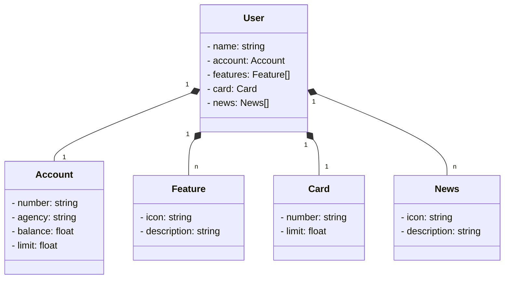

# Bank Account
RESTful API criada em Java 17 com SpringBoot 3

Start do projeto realizado através do site [Spring initializr](https://start.spring.io/)
utilizando as seguintes dependências:

* Spring Web
* Spring Data JPA
* Lombok
* OpenFeign
* H2 Database

e a documentação da API desenvolvida utilizando OpenAPI 3.

## Diagrama de classe
Desenvolvido utilizando IA Generativa com ChatGPT utilizando a sintaxe *Mermaid*

## Configuração

- Clonar o repositório: 
  ``git clone https://github.com/adriana-toni/java-bank-account.git``

- Importar o projeto em uma IDE Java

  - Para iterar com a API: 
    ``http://localhost:8080/swagger-ui/index.html``

## Documentação de Referência
Para referência adicional, considere as seguintes seções:

* [Mermaid Diagramming and charting tool](https://mermaid.js.org/)
* [Official Apache Maven documentation](https://maven.apache.org/guides/index.html)
* [Spring Boot Maven Plugin Reference Guide](https://docs.spring.io/spring-boot/docs/3.1.3/maven-plugin/reference/html/)
* [Spring Web](https://docs.spring.io/spring-boot/docs/3.1.3/reference/htmlsingle/index.html#web)
* [Spring Data JPA](https://docs.spring.io/spring-boot/docs/3.1.3/reference/htmlsingle/index.html#data.sql.jpa-and-spring-data)
* [OpenAPI 3 Library for spring-boot](https://springdoc.org/)
