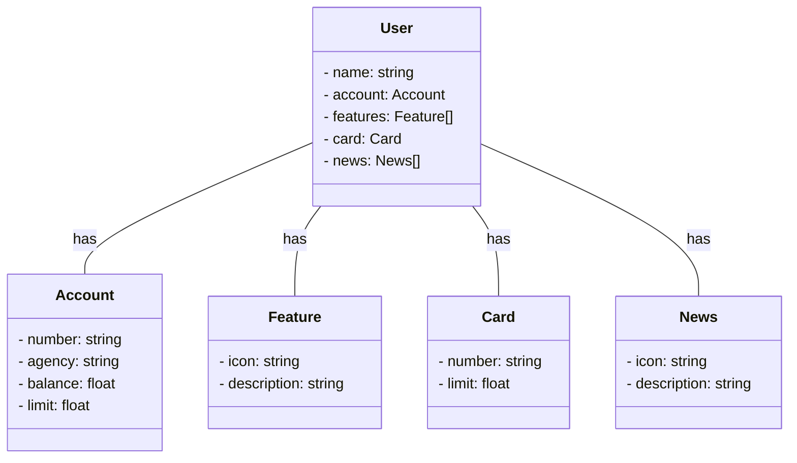

# Bank Account
Java API RESTful criada com SpringBoot

## Diagrama de classe
Desenvolvido utilizando IA Generativa com ChatGPT utilizando a sintaxe *Mermaid*

```mermaid
classDiagram
    class User {
        - name: string
        - account: Account
        - features: Feature[]
        - card: Card
        - news: News[]
    }

    class Account {
        - number: string
        - agency: string
        - balance: float
        - limit: float
    }

    class Feature {
        - icon: string
        - description: string
    }

    class Card {
        - number: string
        - limit: float
    }

    class News {
        - icon: string
        - description: string
    }

    User -- Account: has
    User -- Feature: has
    User -- Card: has
    User -- News: has
```
