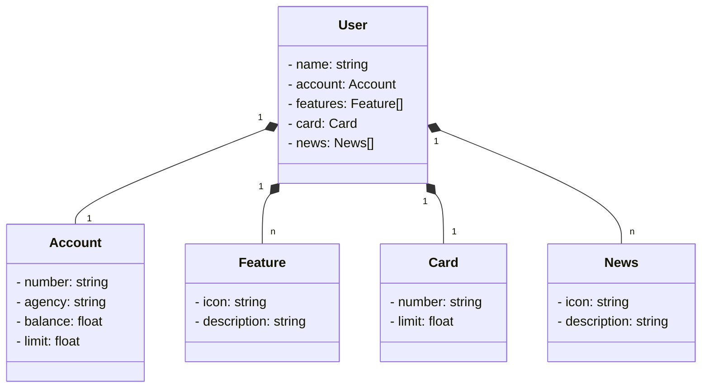

# Bank Account
Java API RESTful criada com SpringBoot

## Diagrama de classe
Desenvolvido utilizando IA Generativa com ChatGPT utilizando a sintaxe *Mermaid*

### Reference Documentation

* [Mermaid Diagramming and charting tool](https://mermaid.js.org/)